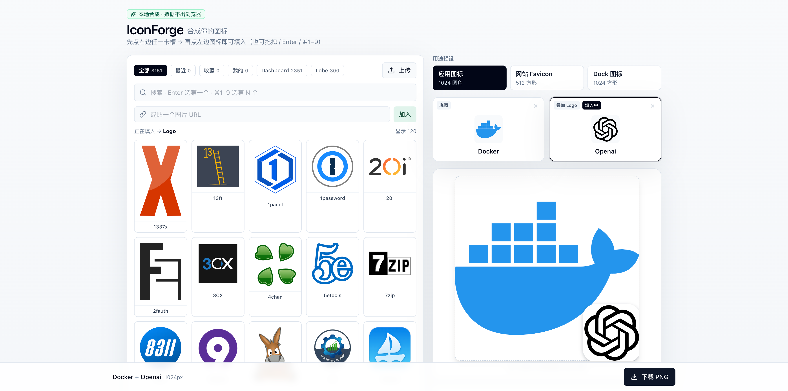
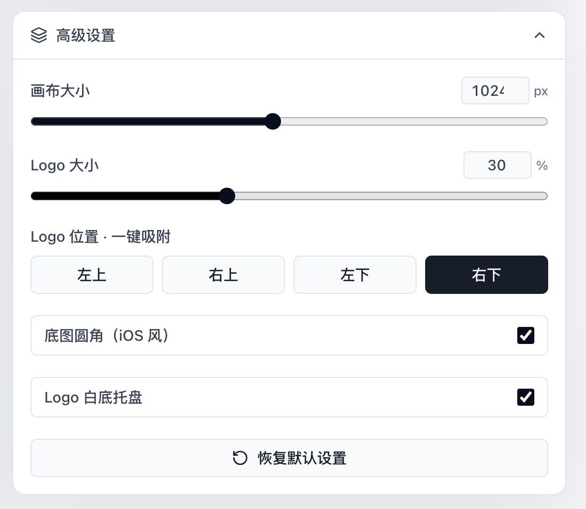

# IconForge

在浏览器里把"底图 + 小 Logo"合成一张图标。本地合成，零后端，数据不出浏览器。

🔗 **在线使用**：[iconforge.qudev.top](https://iconforge.qudev.top/)

<p align="center">
  
  <br/>
  
</p>

## 特性

- 🎯 **两槽合成**：选一张底图，叠一个 Logo，立刻预览 → 下载 PNG
- 🖼️ **数千内置图标**：来自 [dashboard-icons](https://github.com/homarr-labs/dashboard-icons) + [lobe-icons](https://github.com/lobehub/lobe-icons)，自动加载彩色 SVG（无彩色版回退到单色）
- 🖱️ **画布拖拽**：直接在预览上拖动 Logo 调整位置；或用四角一键吸附
- ⚙️ **用途预设**：应用图标 / 网站 Favicon / Dock 图标，一键应用尺寸 + 圆角 + 白底
- ⭐ **收藏 + 最近使用**：常用图标自动顶到列表前面，跨刷新保留
- 🪄 **多种填入方式**：点击 / 拖拽到槽 / Enter 选第一个 / ⌘1–9 选第 N 个
- 💾 **本地持久化**：所有选择和设置存在 localStorage，刷新不丢
- 🔒 **隐私优先**：所有合成在 Canvas 中完成，图片不上传任何服务器

## 技术栈

- [React 19](https://react.dev/) + [TypeScript](https://www.typescriptlang.org/)
- [Vite](https://vitejs.dev/) — 开发与构建
- [Tailwind CSS](https://tailwindcss.com/) — 样式
- [lucide-react](https://lucide.dev/) — 界面图标
- 原生 Canvas API — 图像合成

## 开发

需要 [Node.js](https://nodejs.org/) ≥ 18 与 [pnpm](https://pnpm.io/)。

```bash
pnpm install
pnpm dev        # 启动开发服务器
pnpm build      # 类型检查 + 生产构建
pnpm preview    # 本地预览构建产物
pnpm lint       # 代码检查
```

## 项目结构

```
iconforge/
├── public/          # 静态资源（图标清单、预设）
├── src/
│   ├── components/  # UI 组件
│   ├── lib/         # 工具函数
│   ├── App.tsx      # 主应用
│   └── main.tsx     # 入口
└── index.html
```

## 致谢

图标资源来自两个出色的开源项目：

- [homarr-labs/dashboard-icons](https://github.com/homarr-labs/dashboard-icons) — 服务 / 应用类图标
- [lobehub/lobe-icons](https://github.com/lobehub/lobe-icons) — AI 模型与厂商图标

## License

[MIT](LICENSE)
